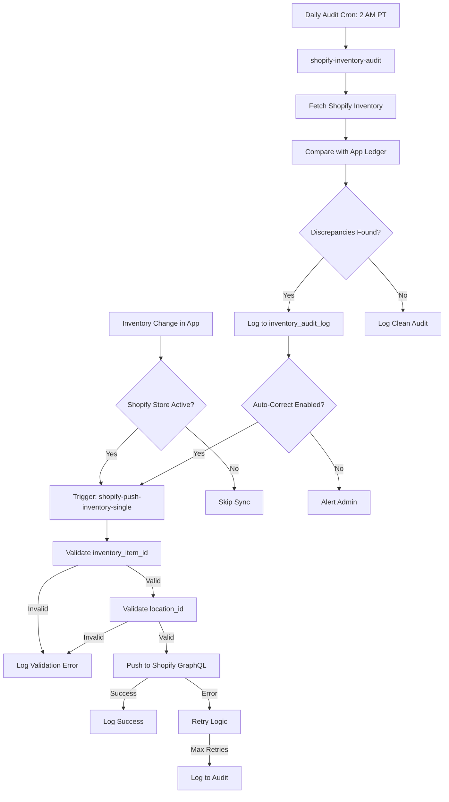
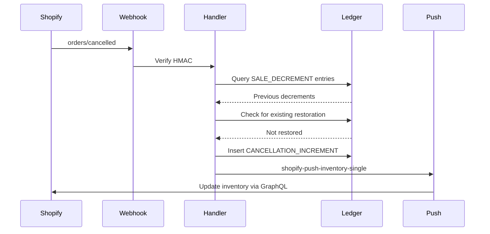

# Inventory Sync System

## Overview
Comprehensive inventory audit and synchronization system to ensure app inventory stays in sync with Shopify.

## Components Implemented

### Phase 1: Order Cancellation Handler ✅
**File:** `supabase/functions/shopify-webhook-handler/index.ts`

**Features:**
- Handles `orders/cancelled` webhook
- Restores inventory when orders are cancelled/refunded
- Creates `CANCELLATION_INCREMENT` ledger entries
- Idempotency check prevents duplicate restorations
- Auto-pushes restored inventory to Shopify

**Transaction Flow:**
1. Webhook received: `orders/cancelled`
2. Query existing `SALE_DECREMENT` entries for that order
3. Create reverse `CANCELLATION_INCREMENT` entries
4. Call `shopify-push-inventory-single` for each SKU

---

### Phase 2: Inventory Audit System ✅

#### 2A: Database Table - `inventory_audit_log`
**Migration:** Added via Supabase migration

**Schema:**
```sql
- id: UUID primary key
- client_id: UUID (with client isolation RLS)
- sku_id: UUID
- app_inventory: INT
- shopify_inventory: INT
- difference: INT (shopify - app)
- inventory_item_id: TEXT (for debugging)
- location_id: TEXT (for debugging)
- status: TEXT (pending, auto_corrected, manually_resolved, ignored)
- auto_correction_attempted: BOOLEAN
- auto_correction_success: BOOLEAN
- audit_type: TEXT (scheduled, manual, post_sync)
- resolved_at: TIMESTAMPTZ
- resolved_by: UUID
- resolution_notes: TEXT
```

**RLS Policies:**
- Admins: Full access
- Clients: Read-only for their own records

#### 2B: Edge Function - `shopify-inventory-audit`
**Endpoint:** `/functions/v1/shopify-inventory-audit`

**Features:**
- Fetches ALL inventory levels from Shopify for active clients
- Compares against app's `inventory_ledger` aggregated quantity
- Logs discrepancies to `inventory_audit_log`
- Auto-corrects discrepancies if enabled in `shopify_sync_config`
- Returns detailed audit report

**Configuration:** Via `shopify_sync_config` table:
- `inventory_audit_enabled`: Enable/disable audits
- `inventory_audit_frequency`: 'hourly', 'daily', etc.
- `auto_correct_discrepancies`: Auto-fix mismatches

**Scheduled Execution:**
- Runs daily at 2:00 AM PT
- Can be triggered manually via API
- Configured in `supabase/config.toml`

**Request Body:**
```json
{
  "client_id": "uuid", // Optional - omit to audit all clients
  "audit_type": "scheduled" // or "manual"
}
```

**Response:**
```json
{
  "success": true,
  "clients_audited": 5,
  "total_discrepancies": 12,
  "total_corrected": 10,
  "duration_ms": 4532,
  "results": [...]
}
```

---

### Phase 3: Validation & Monitoring ✅

#### 3A: Enhanced `shopify-push-inventory-single`
**File:** `supabase/functions/shopify-push-inventory-single/index.ts`

**New Validations:**
1. **Inventory Item Validation:**
   - Queries Shopify to verify `inventory_item_id` exists
   - Checks if item is tracked in Shopify
   - Logs validation errors to `sync_logs.validation_errors`

2. **Location Validation:**
   - Verifies `location_id` exists in Shopify
   - Checks if location is active
   - Logs detailed error if location invalid

**Enhanced Error Logging:**
- Validation failures logged with `validation_errors` JSONB column
- Includes specific field that failed and error message

#### 3B: Admin Dashboard Widgets

**Component:** `InventoryHealthDashboard.tsx`
- Overall health score (% SKUs accurate)
- Discrepancies count (last 7 days)
- Auto-correction success rate
- Average resolution time

**Component:** `InventoryAuditWidget.tsx`
- Recent audit entries (last 10)
- Quick stats: Total / Pending / Resolved
- Manual audit trigger button
- Visual status badges per discrepancy

**Integration:** Added new "Inventory Audit" tab in Admin Dashboard
- Sidebar menu item added
- Tab content shows both widgets side-by-side
- Real-time updates via Supabase subscriptions

#### 3C: Client Notifications

**Component:** `InventoryDiscrepancyAlert.tsx`
- Displays alert banner when pending discrepancies exist
- Shows count of affected SKUs
- "View Details" button opens modal with:
  - SKU details
  - App vs Shopify quantities
  - Difference calculation
  - Status badge

**Integration:** Added to Client Dashboard analytics tab
- Auto-hides when no discrepancies
- Real-time subscription to `inventory_audit_log`

---

### Phase 4: Debug Tools ✅

#### 4A: SKU Mapping Validation Endpoint
**File:** `supabase/functions/shopify-validate-sku-mapping/index.ts`

**Purpose:** Detailed debugging for specific SKU sync issues

**Request:**
```json
{
  "client_id": "uuid",
  "sku_id": "uuid"
}
```

**Validation Checks:**
1. ✅ SKU exists in database
2. ✅ Client-SKU association valid
3. ✅ `shopify_inventory_item_id` alias exists
4. ⚠️ `shopify_variant_id` alias exists (warning if missing)
5. ✅ App inventory calculated
6. ✅ Shopify store active
7. ✅ Location configured
8. ✅ Location exists and active in Shopify
9. ✅ Inventory item exists in Shopify
10. ⚠️ Inventory item tracked (warning if not)
11. ✅ Current Shopify inventory fetched
12. ⚠️ Inventory match check

**Response:**
```json
{
  "success": true,
  "validation": {
    "sku_id": "...",
    "client_id": "...",
    "checks": {
      "client_association": "PASS",
      "inventory_item_alias": "PASS",
      "variant_alias": "PASS",
      "shopify_store": "PASS",
      "location_configured": "PASS",
      "location_exists_shopify": "PASS",
      "inventory_item_exists_shopify": "PASS",
      "inventory_match": "PASS"
    },
    "app_inventory": 100,
    "shopify_inventory": 100,
    "errors": [],
    "warnings": [],
    "overall_status": "PASS"
  }
}
```

#### 4B: Enhanced Sync Logs
**Migration:** Added columns to `sync_logs` table:
- `discrepancies_found`: INT
- `discrepancies_corrected`: INT  
- `validation_errors`: JSONB

**Usage:**
All sync operations now log:
- How many discrepancies were detected
- How many were successfully corrected
- Any validation errors that occurred

---

## How It Works

### Automatic Inventory Correction Flow



### Order Cancellation Flow



---

## Configuration

### Enable Audits for Client
```sql
UPDATE shopify_sync_config
SET 
  inventory_audit_enabled = TRUE,
  inventory_audit_frequency = 'daily',
  auto_correct_discrepancies = TRUE
WHERE client_id = 'client-uuid';
```

### Manual Audit Trigger
```javascript
await supabase.functions.invoke('shopify-inventory-audit', {
  body: {
    client_id: 'client-uuid', // Optional - omit for all
    audit_type: 'manual'
  }
});
```

### Debug Specific SKU
```javascript
await supabase.functions.invoke('shopify-validate-sku-mapping', {
  body: {
    client_id: 'client-uuid',
    sku_id: 'sku-uuid'
  }
});
```

---

## Admin Dashboard Access

### Inventory Audit Tab
Navigate to: **Admin Dashboard → Inventory Audit**

**Widgets:**
1. **Inventory Health Dashboard**
   - Overall health score
   - Discrepancies (7 days)
   - Auto-correction rate
   - Avg resolution time

2. **Inventory Audit Widget**
   - Recent audit entries
   - Stats: Total / Pending / Resolved
   - Manual audit button
   - Per-entry status badges

### Shopify Management Tab
Navigate to: **Admin Dashboard → Shopify → Inventory Repair Tools**

**New Tool:** Inventory Audit card
- Links to Audit Dashboard
- Quick access from sync management

---

## Client Portal Features

### Analytics Tab
**Component:** `InventoryDiscrepancyAlert`

**Displays When:**
- Client has pending discrepancies in `inventory_audit_log`

**Shows:**
- Count of affected SKUs
- "View Details" button
- Modal with per-SKU breakdown:
  - App inventory
  - Shopify inventory
  - Difference
  - Status badge

**Real-time:**
- Subscribes to `inventory_audit_log` changes
- Auto-updates when new discrepancies logged
- Hides when all resolved

---

## Monitoring & Alerts

### Sync Logs Enhanced
All sync operations now log:
```javascript
{
  sync_type: 'inventory_audit',
  status: 'success',
  products_synced: 150,
  discrepancies_found: 5,
  discrepancies_corrected: 4,
  validation_errors: {
    // JSONB with specific errors
  }
}
```

### Audit Log Queries

**Get pending discrepancies for all clients:**
```sql
SELECT 
  c.company_name,
  s.client_sku,
  ial.app_inventory,
  ial.shopify_inventory,
  ial.difference,
  ial.audit_timestamp
FROM inventory_audit_log ial
JOIN clients c ON c.id = ial.client_id
JOIN skus s ON s.id = ial.sku_id
WHERE ial.status = 'pending'
ORDER BY ial.audit_timestamp DESC;
```

**Get auto-correction success rate:**
```sql
SELECT 
  COUNT(*) FILTER (WHERE auto_correction_success = TRUE) as corrected,
  COUNT(*) FILTER (WHERE auto_correction_attempted = TRUE) as attempted,
  ROUND(
    (COUNT(*) FILTER (WHERE auto_correction_success = TRUE)::numeric / 
     COUNT(*) FILTER (WHERE auto_correction_attempted = TRUE)::numeric) * 100,
    2
  ) as success_rate
FROM inventory_audit_log
WHERE audit_timestamp > NOW() - INTERVAL '7 days';
```

---

## Troubleshooting

### Common Issues

**1. Audit finds discrepancies but doesn't auto-correct**
- Check `shopify_sync_config.auto_correct_discrepancies` is TRUE
- Verify client has valid `shopify_location_id`
- Check `sync_logs` for validation errors

**2. SKU not syncing to Shopify**
- Run debug endpoint: `/functions/v1/shopify-validate-sku-mapping`
- Check for missing `sku_aliases` entries
- Verify `inventory_item_id` exists in Shopify

**3. Order cancellations not restoring inventory**
- Check `inventory_ledger` for `CANCELLATION_INCREMENT` entries
- Verify webhook is registered: `orders/cancelled`
- Check `webhook_delivery_logs` for failed webhooks

**4. Location validation failing**
- Verify client's `shopify_location_id` is set
- Check location is active in Shopify admin
- Run location sync: `/functions/v1/shopify-sync-locations`

---

## Performance Considerations

### Batch Processing
- Audit processes 100 SKUs at a time
- 500ms delay between batches to prevent DB overload
- Comprehensive sync has 5-minute intervals

### Rate Limiting
- Shopify GraphQL respects rate limits
- Auto-retry with exponential backoff
- Max 3 retries per operation

### Indexing
All audit queries use optimized indexes:
- `idx_inventory_audit_client` - Client + timestamp
- `idx_inventory_audit_sku_pending` - SKU + status (pending only)
- `idx_inventory_audit_unresolved` - Client + status + timestamp

---

## Security

### RLS Policies
- Admins: Full access to all audit logs
- Clients: Read-only access to own audit logs
- Service role: Write access for edge functions

### Data Isolation
- All client queries filter by `client_id`
- Webhook handler validates shop domain
- Cross-client access prevented by RLS

---

## Maintenance

### Scheduled Jobs
1. **Daily Audit:** 2:00 AM PT - `shopify-inventory-audit`
2. **Webhook Cleanup:** 2:00 AM PT - `cleanup-old-webhooks`
3. **QC Photos Cleanup:** 2:00 AM PT - `cleanup-qc-photos`
4. **Comprehensive Sync:** Every 5 minutes - `shopify-comprehensive-sync`

### Data Retention
- `inventory_audit_log`: Keep indefinitely for analytics
- `sync_logs`: 90-day retention
- `webhook_delivery_logs`: 30-day retention

---

## Next Steps

### Recommended Enhancements
1. **Email Notifications:** Alert clients when discrepancies exceed threshold
2. **Audit Reports:** Generate weekly PDF reports for clients
3. **Predictive Alerts:** ML-based detection of recurring sync issues
4. **Bulk Operations:** UI for resolving multiple discrepancies at once
5. **Webhook Health:** Monitor webhook delivery success rates

### Testing Checklist
- [ ] Create test order in Shopify
- [ ] Cancel order and verify inventory restoration
- [ ] Run manual audit via admin dashboard
- [ ] Verify discrepancies appear in audit log
- [ ] Confirm auto-correction works
- [ ] Check client sees alert in portal
- [ ] Validate debug endpoint returns correct data
- [ ] Monitor scheduled audit execution

---

## API Reference

### Audit Endpoint
```bash
POST /functions/v1/shopify-inventory-audit
Content-Type: application/json

{
  "client_id": "optional-uuid",
  "audit_type": "manual"
}
```

### Validation Endpoint
```bash
POST /functions/v1/shopify-validate-sku-mapping
Content-Type: application/json

{
  "client_id": "uuid",
  "sku_id": "uuid"
}
```

### Push Endpoint (Updated)
```bash
POST /functions/v1/shopify-push-inventory-single
Content-Type: application/json

{
  "client_id": "uuid",
  "sku_id": "uuid"
}
```
Now includes validation checks before pushing.
